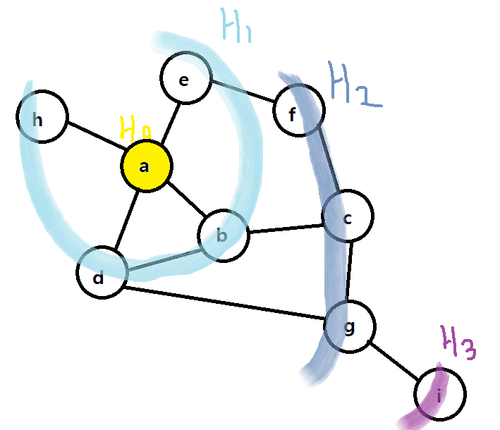

## BFS (Breadth First Search)

- 시작점에서 가까운 정점부터 순서대로 방문하는 탐색 알고리즘.
- 재귀적으로 동작하지 않는다.
- 어떤 노드를 방문했었는지 여부를 반드시 검사해야한다. 안그러면 무한루프에 빠질 수 있다.
- 방문한 노드는 큐에 저장한다.



1. 맨 처음에는 시작점 노드를 큐에 넣고, 해당 노드의 자식 노드들을 큐에 담는다.

   => 시작점인 a를 방문하고 나면 인접한 노드인 정점 b,d,e,h가 목록에 추가된다. 

   이들은 모두 a에서 간선 하나로 연결되어 있기 때문에, 어느 정점을 먼저 꺼내서 방문해도 상관 없다.

2. 큐에서 꺼낸 노드를 방문하고, 해당 노드의 자식 노드를 큐에 담는다.

    => 이 중 b를 꺼내 방문했다고 하면 c가 목록에 추가된다. 

   이때 c는 자신보다 먼저 목록에 추가된 남은 정점 b,e,h가 전부 방문되기 전까진 결코 방문되면 안된다. 그러므로 큐를 사용하여 너비우선탐색의 조건을 만족시킬 수 있다.

```java
package bfs;

import java.util.LinkedList;
import java.util.Queue;

class Graph {
    class Node {
        char data;
        LinkedList<Node> adjacent;
        boolean marked;

        Node(char data) {
            this.data = data;
            this.marked = false;
            adjacent = new LinkedList<Node>();
        }
    }

    Node[] nodes;

    Graph(int size) {
        nodes = new Node[size];
        for (int i = 0; i < size; i++) {
            nodes[i] = new Node((char) (i + 65));
        }
    }

    void addEdge(int i1, int i2) {
        Node n1 = nodes[i1];
        Node n2 = nodes[i2];
        if (!n1.adjacent.contains(n2)) {
            n1.adjacent.add(n2);
        }
        if (!n2.adjacent.contains(n1)) {
            n2.adjacent.add(n1);
        }
    }

    void bfs(int index) {
        Node root = nodes[index];
        Queue<Node> queue = new LinkedList<Node>();
        queue.add(root);
        root.marked = true;

        while (!queue.isEmpty()) {
            //큐에서 노드를 하나 꺼낸 다음 방문한다
            Node r = queue.poll();
            //인접한 노드들 중 방문하지 않은 노드를 큐에 넣는다
            for (Node n : r.adjacent) {
                if (n.marked == false) {
                    n.marked = true;
                    queue.add(n);
                }
            }
            visit(r);
        }
    }

    void visit(Node n) {
        System.out.print(n.data + " ");
    }
}

public class BfsTest {
    public static void main(String[] args) {
        Graph g = new Graph(9);
        g.addEdge(0, 1);
        g.addEdge(0, 4);
        g.addEdge(0, 3);
        g.addEdge(0, 7);
        g.addEdge(4, 5);
        g.addEdge(5, 2);
        g.addEdge(2, 6);
        g.addEdge(3, 1);
        g.addEdge(3, 6);
        g.addEdge(1, 2);
        g.addEdge(6, 8);
        g.bfs(0);
    }
}

```

 결과

```
A B E D H C F G I 
```


---

## 참고자료

- 알고리즘 문제해결전략 2

- https://gmlwjd9405.github.io/2018/08/15/algorithm-bfs.html

- https://coding-factory.tistory.com/612

- https://youtu.be/_hxFgg7TLZQ

- [java queue](https://coding-factory.tistory.com/602)