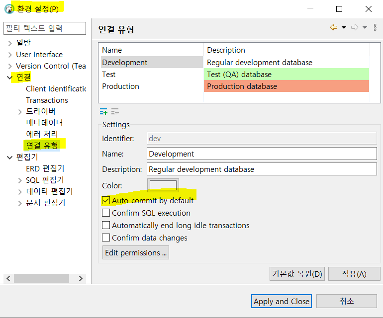
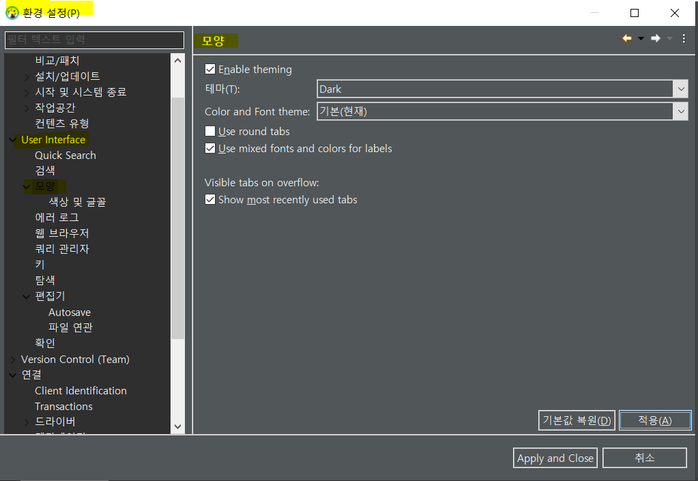
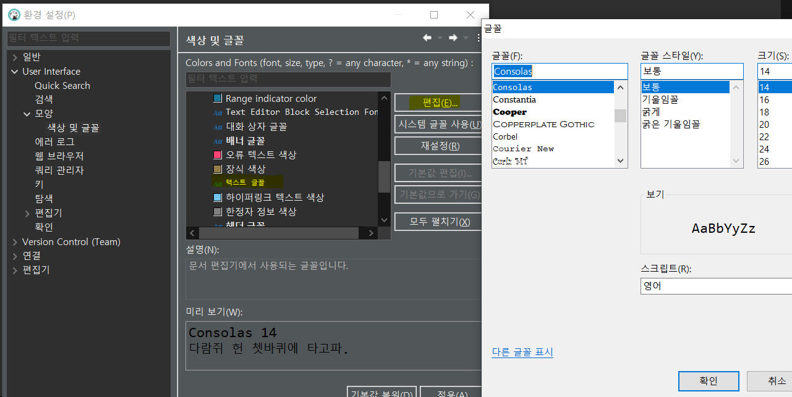

### DBeaver란

- **무료 데이터베이스 관리 툴.**
- open source
- 멀티 플랫폼: Mac OS, Linux, Windows
- JDBC 드라이버를 통한 데이터베이스 통신
- 다양한 DB지원: MySQL, MariaDB, SQLite, Oracle ...

### DBeaver 설치

- 설치 링크 : https://dbeaver.io/download/

---

### DBeaver auto commit 설정

- **윈도우 - 환경설정 - 연결 - 연결 유형**

  에서 auto commit 설정을 할 수 있다. 기본적으로 `auto-commit by default`에 체크되어있으므로 auto-commit을 해제하려면 체크박스를 해제하면 된다.

### DBeaver 테마 , 폰트 설정

- **윈도우 - 환경설정 - User Interface - 모양**

  에서 테마와 글꼴, 색상 등을 변경할 수 있다.

폰트 크기를 바꾸려면 **색상 및 글꼴 - 기본 - 텍스트 글꼴 - 편집** 에 들어가서 편집하면 된다.

---

### 참고자료

- https://wylee-developer.tistory.com/39

- https://post.naver.com/viewer/postView.nhn?volumeNo=26982618&memberNo=227705

