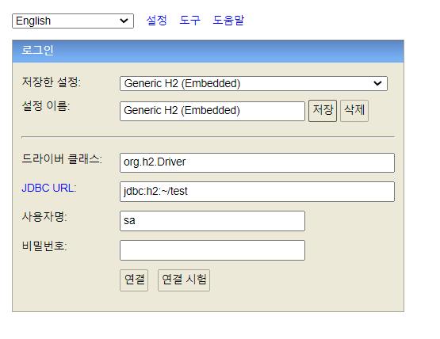
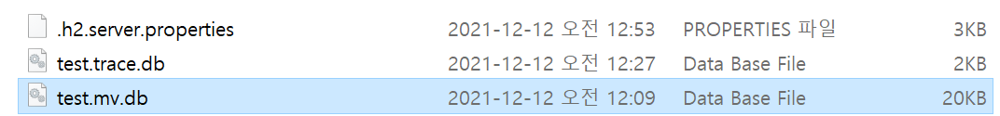
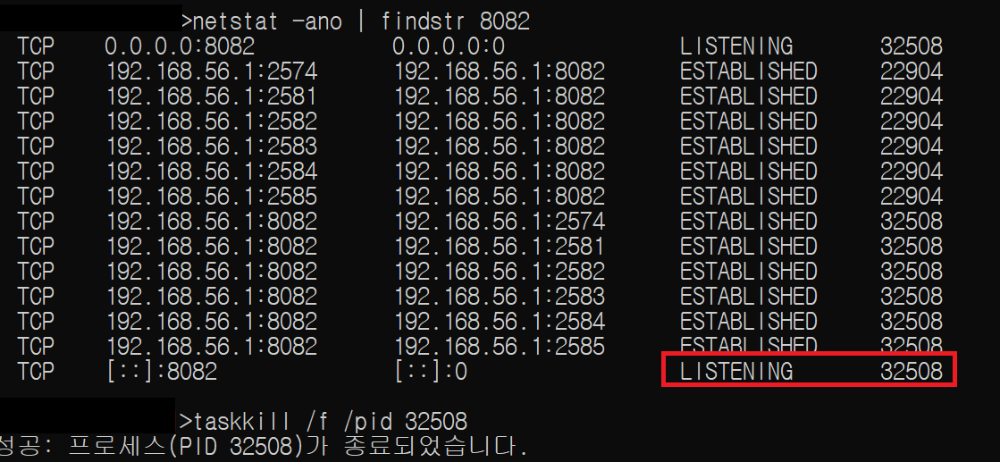

*윈도우 기준
### h2 설치

다운로드 링크 : https://www.h2database.com/html/download.html

설치 후에 `~사용자/H2/bin` 으로 들어가서 `h2.bat` 을 실행하면 h2 데이터베이스 콘솔에 접속할 수 있다. 
또는 http://localhost:8082/ 로 접속하면 된다. 




---

### h2 데이터베이스란?

- java 기반의 오픈소스 RDBMS
- Embedded mode와 Server mode 두가지를 지원한다.
- 가볍고 빠르기 때문에 테스트용 DB로 많이 이용된다.


---

### SpringBoot 에서 사용하기
```yaml

spring:
  application:
    name: jpastudy
  datasource:
    url: jdbc:h2:tcp://localhost/~/test
    username: sa
    password:
    driver-class-name: org.h2.Driver
  jpa:
    hibernate:
      ddl-auto: create-drop
    properties:
      hibernate:
        show_sql: false
        format_sql: true
```

---

### H2 삭제

- 프로그램 제거를 한다고 깔끔히 삭제되지 않는다.
- 사용자 폴더에서 아래 파일들도 함께 삭제해준다.



- 위 파일들을 삭제하려면 H2 DB 프로세스를 종료시켜야 하는데 아래와 같은 방법으로 종료할 수 있다.
8082포트를 사용하고 있는 프로세스 중에 리스닝하고 있는 프로세스를 찾아서 죽인다.
```shell
netstat -ano | findstr 8082

taskkill /f /pid [pid]
```
