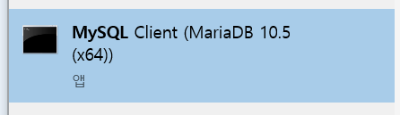

mariaDB를 설치하면 mysql이 같이 설치된다.

window에서 **cmd창으로 mysql에 접속하려면 먼저 path를 설정**해줘야 한다. mariaDB나 mysql을 설치한 경로(~`\bin`)


----


1.  **cmd로 접속 (최초에 path 설정 필요)**

```
mysql -u root -p [db name]
```


**sql문 실행**시

```
mariaDB[(none)] > [소스파일 경로+소스파일명]
```

위의 경우는 경로를 적어주거나 해당 파일이 있는 경로로 들어가서 소스파일 이름만 적어줘도 된다.


2. **MySQL client로 접속**

