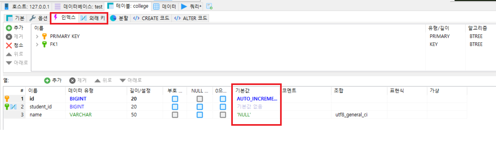

## MySQL - 테이블 구조, 데이터 복사


### 테이블 구조 복사

```sql
CREATE TABLE [NEW_TABLE] LIKE [OLD_TABLE];
```

- 기존 테이블의 설정 그대로 (제약조건 포함) 복사가 된다.
- **테이블 구조만 복사가 되고, 데이터는 복사되지 않는다.** 데이터 복사가 필요하다면 `insert`문을 추가해주면 되겠다.


### 구조와 데이터 복사

```SQL
CREATE TABLE [NEW_TABLE]
SELECT * FROM [OLD_TABLE];

CREATE TABLE [NEW_TABLE] AS
SELECT * FROM [OLD_TABLE];
```

- 테이블의 구조와 함께 **데이터도 복사**가 된다.
- **다만 기본키(primary key), index, auto increment는 제외하고 복사된다.**


---


테스트용으로 college 테이블을 생성하였다.

```sql
CREATE TABLE `college` (
	`id` BIGINT(20) NOT NULL AUTO_INCREMENT,
	`student_id` BIGINT(20) NOT NULL,
	`name` VARCHAR(50) NOT NULL DEFAULT 'NULL' COLLATE 'utf8_general_ci',
	PRIMARY KEY (`id`) USING BTREE,
	INDEX `FK1` (`student_id`) USING BTREE,
	CONSTRAINT `FK1` FOREIGN KEY (`student_id`) REFERENCES `test`.`member` (`id`) ON UPDATE RESTRICT ON DELETE RESTRICT
)
COLLATE='utf8_general_ci'
ENGINE=InnoDB
AUTO_INCREMENT=2
;
```




```sql
CREATE TABLE new_college
SELECT * FROM college;
```

아래와 같이 데이터와 구조만 복사되고 auto increment와 primary key, index가 하나도 적용되지 않은 것은 확인할 수 있었다.


---

## 참고자료

- https://lelecoder.com/11

- https://m.blog.naver.com/kilsu1024/110162891049