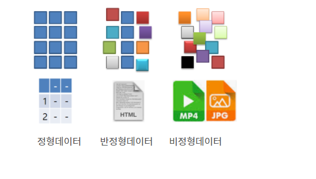

sql은 알겠는데, `NoSQL`은 뭐지? 싶어서 찾아보게 된 내용을 간략히 정리하려고 한다.

---


SNS가 활발해지면서 비정형데이터가 쏟아지면서 비정형데이터를 보다 쉽게 담아서 저장하고 처리할 수 있는 DB들이 관심을 받게 되었고, 이로 인해 NoSQL이 각광을 받게 되었다고 한다.

- **비정형데이터** 
  - 스키마 구조 X
  - 연산 불가




### NoSQL

- **Not Only SQL**
- 관계형 모델을 사용하지 않으며 **테이블 간의 join 기능 없음.**

- **유연한 스키마** (Schema)
  - 정형, 비정형, 반정형 데이터 모두 처리가 가능하다.
  - DB에서 말하는 ***스키마***는 <u>DB를 구성하는 개체(Entity), 속성(Attribute), 관계(Relationship) 및 데이터 조작 시에 데이터값들이 갖는 제약조건 등에 관해 전반적으로 정의하는 것</u>이다. 스키마가 존재한다는 것은 그 구조가 미리 정의되어있어야한다는 것으로, 데이터의 급격한 변화에 대응하기 힘들다는 단점이 있다.

- **수평확장(Horizontal Scale Out)**이 가능하다.
  - 수직확장은 컴퓨터에 추가로 스토리지를 장착해서 저장공간을 늘리는 것을 의미하는데, 관계형 데이터베이스는 수직확장만 가능하다. 수평확장은 내 컴퓨터 용량을 늘리는 대신 다른 컴퓨터(노드)를 저장소로 사용하는 것이다. 이를 '**분산 데이터베이스**'라고 한다.

- **NoSQL DB 종류 : Redis, MongoDB...**


-----


### MongoDB

- **json 타입의 document 방식의 NoSQL.**

- **스키마가 없다.**

  

  #### Database, Collection, Document

  - **Database**
    - 컬렉션의 물리적 컨테이너. 보통 하나의 데이터베이스에 여러개의 컬렉션을 가지고 있다.
  - **Collection**
    - RDBMS의 table과 유사한 개념.
  - **Document**
    - key-value의 집합으로 이루어진다.
    - 동적스키마. (동일한 collection 내의 document가 동일한 필드나 구조를 가질 필요X)

  


`use DATABASE_NAME` 명령어를 통해서 Database를 생성할 수 있는데, 데이터베이스가 이미 존재하는 경우엔 현존하는 DB를 사용한다.

```
//DB 생성
use DATABASE_NAME
```

리스트에서 방금 만든 데이터베이스를 보려면 최소 한개의 `Document`를 추가해야한다.

```
//DB 리스트 확인
show dbs

//document 추가
db.COLLECTION_NAME.insert({"name": "mongoDB", "author": "test"});
```

Collection을 미리 생성하지 않아도 위 명령어를 작성하는데 차질이 없다고 한다.


----

### 참고자료

- https://www.samsungsds.com/kr/insights/1232564_4627.html

- [쉽게 설명한 NoSQL](https://chankim.tistory.com/5)

- https://cionman.tistory.com/44

- https://m.blog.naver.com/PostView.naver?isHttpsRedirect=true&blogId=sundooedu&logNo=221342439937

- [MongoDB CRUD](https://myjamong.tistory.com/56)

- [MongoDB Database/Collection/Document 생성/제거](https://velopert.com/457)

- [MongoDB Collection, Document란 무엇인가?](https://javacpro.tistory.com/66)