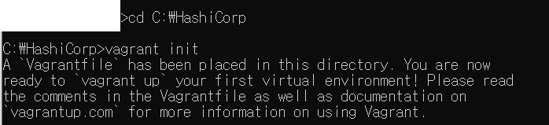
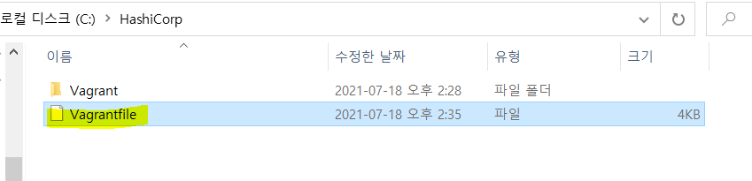
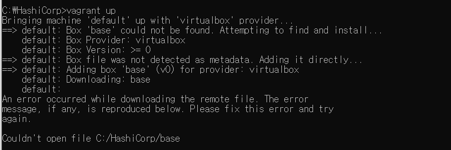
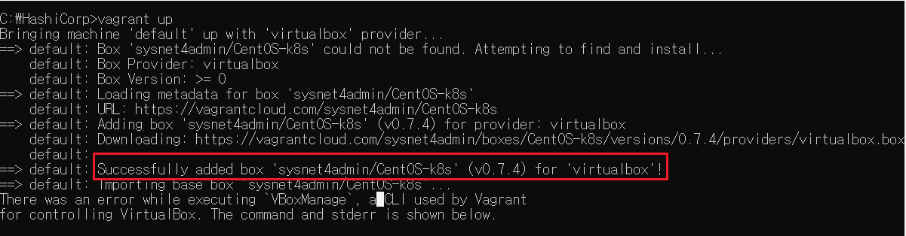
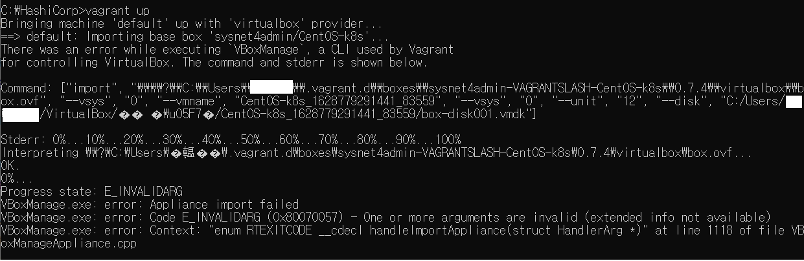
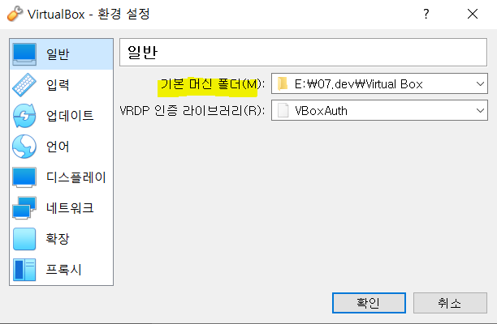
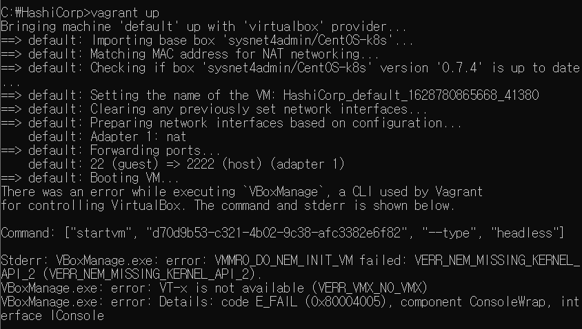
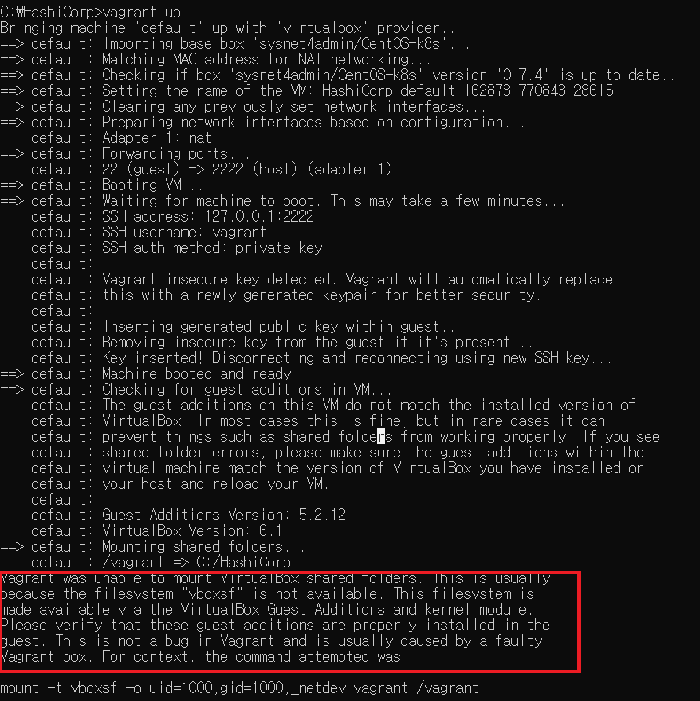
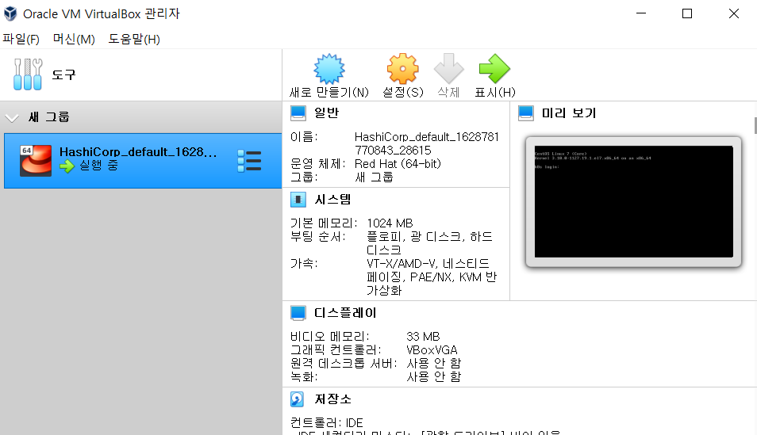

### 도커

- 컨테이너 환경에서 독립적으로 애플리케이션을 실행할 수 있도록 컨테이너를 만들고 관리하는 것을 도와주는 컨테이너 도구.
- 도커로 애플리케이션을 실행하면 운영체제 환경에 관계없이 독립적인 환경에서 일관된 결과를 보장한다.
- 컨테이너 도구들 : 도커, Containerd(컨테이너디), CRI-O(크라이오), Podman 등


### 쿠버네티스

- 다수의 컨테이너를 관리하는 데 사용.
- 컨테이너의 자동 배포와 배포된 컨테이너에 대한 동작 보증, 부하에 따른 동적 확장 등의 기능 제공
- 처음에는 다수의 컨테이너만 관리하는 도구였으나 지금은 컨테이너 인프라에 필요한 기능을 통합하고 관리하는 솔루션으로 발전함.


###  젠킨스

- **지속적 통합(CI),  지속적 배포(CD)를 지원 :** 개발한 프로그램의 빌드, 데스트, 패키지화, 배포 단계를 모두 자동화해 개발단계를 표준화 한다.


### 모니터링을 위한 도구

- **프로메테우스** : 모니터링 데이터 수집 도구 
  - (오픈소스를 활용하는 기업은 프로메테우스 외에 다른 선택지가 없을 정도로 탁월한 효율을 자랑한다.)
- **키바나, 그라파나 :** 데이터를 시각화하는 도구


----


### 왜 쿠버네티스일까


----

### 베어그런트 구성하고 테스트하기

- 베어그런트를 설치하고, `vagrant init` 명령을 실행해 **프로비저닝에 필요한 기초 파일을 생성한다.**



- 생성된 `Vagrantfile`(베어그런트 스크립트 파일)을 에디터 프로그램에서 열어서 `config.vm.box = "base"`라는 내용이 있는지 확인한다.



```
  # Every Vagrant development environment requires a box. You can search for
  # boxes at https://vagrantcloud.com/search.
  config.vm.box = "base"
```

- `vagrant up` : `Vagrantfile`을 읽어들여 **프로비저닝을 진행**한다.



위의 `config.vm.box = "base"`로 설치하려는 이미지가 `base`로 명시되어 있으나 베이그런트가 해당 이미지를 찾지 못해 에러가 발생한다.

그러므로 [베이그런트 클라우드](https://app.vagrantup.com/boxes/search)에 접속하여 가상이미지를 내려받고, `Vagrantfile`의 내용을 변경한 후에 다시 위의 명령어를 실행해본다.

```
config.vm.box = "sysnet4admin/CentOS-k8s"
```





아래와 같은 에러가 발생하여 C드라이브 용량 부족일까 싶어 일단 virtual box 기본 머신 폴더 경로를 변경하였다.






그러고나서 해당 가상머신 이미지는 내려받아졌으나 실행이 되지 않는 문제가 발생하였다.



알고보니 **hyper-v 때문에 윈도우10에서 vagrant & VirtualBox와 Docker를 동시에 실행할 수 없다**고 한다. 


#### hyper-v 끄는 방법

관리자모드에서 아래 명령어 실행 후 재부팅한다.

```
C:\Windows\system32>bcdedit /set hypervisorlaunchtype off
```


다시 `vagrant up`을 실행하니 vm에서 실행되는 것을 확인할 수 있었다. 아래 빨간색으로 표시해둔 부분은 버추얼박스 게스트 에디션을 설치되지 않아서 발생하는 거라고 하는데 내가 공부하는 책에선 필요하지 않아 설치하지 않는다고 하니 나도 생략하였다.






----------

### 참고자료

- https://stackoverflow.com/questions/37955942/vagrant-up-vboxmanage-exe-error-vt-x-is-not-available-verr-vmx-no-vmx-code

- [hyper-v 끄는 방법 ](https://calen.tistory.com/5)