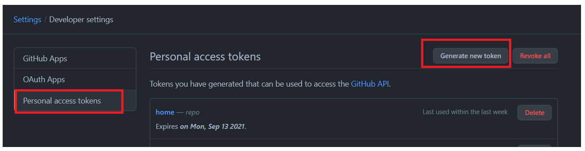
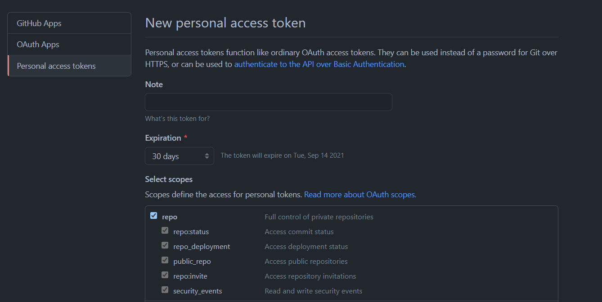

8월 13일 부터 비밀번호로 인증하는 방식은 사라지고 token으로 인증하는 방식으로 대체되었다고 한다.

```
remote: Support for password authentication was removed on August 13, 2021. Please use a personal access token instead.
remote: Please see https://github.blog/2020-12-15-token-authentication-requirements-for-git-operations/ for more information.

```


**token생성은 깃허브 사이트에서 setting-developer setting-personal access token에 들어가서 genterate new token**을 하면 된다.

생성된 토큰은 그 생성된 직후에만 확인이 가능하므로 가능하면 안전한 곳에 복사해서 저장해두는 것이 중요하다. 안 그러면 새로운 토큰을 계속 생성해야하니 좀 귀찮...





나는 아래와 같이 하여 정상적으로 push할 수 있었다.

```
git remote set-url origin https://[token]@github.com/[user-name]/[repository]
```

