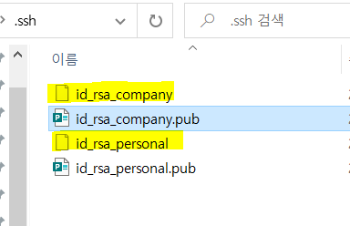
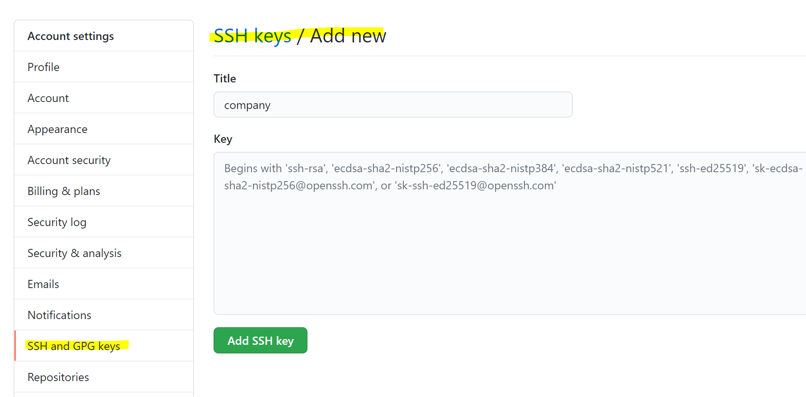

만약 `.ssh`디렉토리가 없을 경우 사용자 디렉토리에 생성하면 된다.

```
mkdir .ssh
```


1. **SSH key 생성**

   ```
   $ ssh-keygen -t rsa -b 4096 -C [이메일]
   
   $ ssh-keygen -t rsa -b 4096 -C [이메일]
   Generating public/private rsa key pair.
   Enter file in which to save the key (/Users/dpudpu/.ssh/id_rsa): /Users/example/.ssh/id_rsa_company
   ```

   key를 생성하면 key의 이름을 입력하게 되는데 기본값은 `id_rsa`이다.

   나는 회사에서 쓸 것과 개인적으로 쓸 것을 구분하기 위해 `id_rsa_company`와 `id_rsa_personal`로 설정했다.

   ​	

   `.ssh`디렉토리에서 아래와 같이 ssh key가 생성된 것을 확인할 수 있다.




2. **github/gitlab에 key등록하기**

   아래의 캡쳐는 github이다.  settings에서 add key를 할 수 있다.

```
$ cat ~/.ssh/id_rsa_company.pub
```

위 명령어를 통하여 키값을 복사하여 github에 add한다.



3. **`~/.ssh/config`파일에 (없다면 새로 생성) 아래와 같이 쓴다.**

   ```
   # company
   Host company-gitlab.com
   HostName gitlab.com
   User git
   IdentityFile ~/.ssh/id_rsa_company
   
   # personal
   Host personal-github.com
   HostName github.com
   User git
   IdentityFile ~/.ssh/id_rsa_personal
   ```

연결이 되는지 테스트한다.

```
$ ssh -T company-gitlab.com
```


4. **gitconfig, gitconfig-* 설정하기.**

   `gitconfig`파일에 아래와 같은 방식으로 적는다. 폴더에 따라 다른 git 계정을 사용할 수 있도록 하는 것이다.

   아래는 예시이다.

   ```
   [includeIf "gitdir:~/Company/"]
   	path = .gitconfig-company
   [includeIf "gitdir:~/Personal/"]
   	path = .gitconfig-personal
   ```

   그리고 `path`변수에 들어간 `.giconfig-*`를 만들어준다.

   예를 들면, `.gitconfig-personal`파일을 만들고 아래와 같이 적는다.

   ```
   $cat > ,gitconfig-personal
   [파일 내용]
   ```

   입력을 마칠 때는 ctrl+d를 누르면 된다.

   ```
   [user]
   	email = {이메일 주소}
   	name = {이름}
   [github]	
   	user = {유저명}
   ```

   그리고 위와 같이 적으면 된다.


----

### 참고자료

- https://dublin-java.tistory.com/62

- https://yangeok.github.io/git/2020/03/08/ssh-multiple-account.html

- [리눅스 명령어 cat](https://m.blog.naver.com/seunggon25/20197325534)