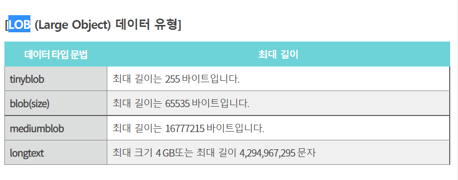

### @Lob 

> Specifies that a **persistent property or field should be persisted as a large object to a database-supported large object type.**
> Portable applications should use the Lob annotation when mapping to a database Lob type. The Lob annotation may be used in conjunction with the Basic annotation or the ElementCollection annotation when the element collection value is of basic type. A Lob may be either a binary or character type.
> The Lob type is inferred from the type of the persistent field or property, and except for string and character-based types defaults to Blob.

```java
	//Example 1:
  
     @Lob @Basic(fetch=LAZY)
     @Column(name="REPORT")
     protected String report;
  
     //Example 2:
  
     @Lob @Basic(fetch=LAZY)
     @Column(name="EMP_PIC", 	columnDefinition="BLOB NOT NULL")
     protected byte[] pic;
  
```




---

###  참고자료

- [sql mariadb 데이터 유형 소개](https://shlee1990.tistory.com/528)

- [sql error: 1406 해결방법](https://velog.io/@hkoo9329/SQL-Error-1406-1ek3h34odw)