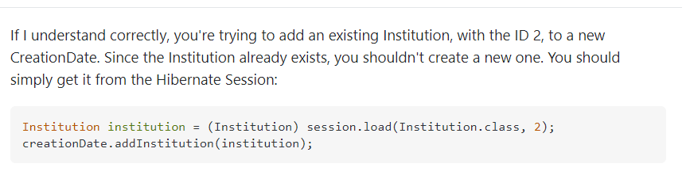

**2021-06-30**


jpa에서 아래 에러가 발생했다.

나의 경우 중복된 `id`로 데이터를 register(create)하려고 해서 발생한 에러였다. 

```
row was updated or deleted by another transaction (or unsaved-value mapping was incorrect)
```


참고할만한 자료는 [이거](https://stackoverflow.com/questions/16697162/hibernate-row-was-updated-or-deleted-by-another-transaction-or-unsaved-value-m)정도?



