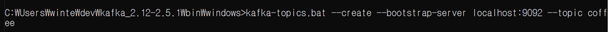

- publish-subscribe model
- 비동기식 메세징 패턴(Asynchronous Messaging Pattern)

>1. 우체부(Publisher)가 편지(Message)를 넣는다.
>2. 편지(Message)는 우체통(Broker or Channel)에 넣는다.
>3. 각 집의 호수(Topic)에 맞게끔 편지(Message)를 넣는다.
>4. 우리(Subscriber)는 우체통에 들어 있는 편지를 가져간다.
>
>출처: https://sugerent.tistory.com/585 [MISTERY]


----------


### Kafka

- 링크드인에서 개발된 분산 메세징 시스템.
- MSA에서 서비스 간에 통신

- pub-sub model
  - publish : producer
  - subscribe : consumer

- zookeeper :


[이 링크](https://oingdaddy.tistory.com/274)를 참고하여 kafka를 설치하고, 예제를 따라해보았다.


1. zookeeper 실행
2. kafka 실행
3. topic 생성

```
kafka-topics.bat --create --bootstrap-server localhost:9092 --topic coffee
```





---------


### Spring Cloud Stream


------------

## 참고자료

- https://sugerent.tistory.com/585

- https://honglab.tistory.com/61

- https://needjarvis.tistory.com/598?category=925090

- https://coding-start.tistory.com/139

- **[springcloudstream과 kafka 연동하기](https://kamang-it.tistory.com/entry/KafkaJavaSpringBootSpringCloudStreamSpringCloudStream%EA%B3%BC-Kafka-%EC%97%B0%EB%8F%99%ED%95%98%EA%B8%B0?category=799882)**

- **[window 환경에 kafka설치하고 간단히 테스트 해보기](https://oingdaddy.tistory.com/274)**

- **[apache kafka 구축 - springboot 기반 msa](https://mr-spock.tistory.com/46)**

  