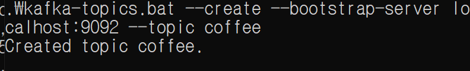
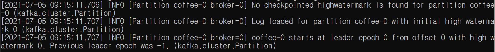
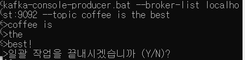
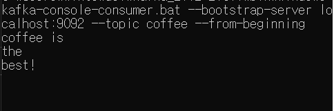

### pub-sub model

- publish-subscribe model
- 비동기식 메세징 패턴(Asynchronous Messaging Pattern)

>1. 우체부(Publisher)가 편지(Message)를 넣는다.
>2. 편지(Message)는 우체통(Broker or Channel)에 넣는다.
>3. 각 집의 호수(Topic)에 맞게끔 편지(Message)를 넣는다.
>4. 우리(Subscriber)는 우체통에 들어 있는 편지를 가져간다.
>
>출처: https://sugerent.tistory.com/585 [MISTERY]


----------


### Kafka

- 링크드인에서 개발한 분산 메세징 시스템.
- MSA에서 서비스 간에 통신

- pub-sub model
  - publish : producer
  - subscribe : consumer


[이 링크](https://oingdaddy.tistory.com/274)를 참고하여 kafka를 설치하고, 예제를 따라해보았다.


1. **zookeeper 실행**

   ```
   zookeeper-server-start.bat ..\..\config\zookeeper.properties
   ```

   

2. **kafka 실행**

   ```
   kafka-server-start.bat ..\..\config\server.properties
   ```

   

3. **topic 생성**

```
kafka-topics.bat --create --bootstrap-server localhost:9092 --topic coffee
```



kafka-server에서 `topic`이 생성된 것을 확인할 수 있다.




4. producer

   ```
   >kafka-console-producer.bat --broker-list localhost:9092 --topic coffee
   >[메세지]
   ```

   



5. consumer

   ```
   kafka-console-consumer.bat --bootstrap-server localhost:9092 --topic coffee --from-beginning
   ```

   



---------


### Spring Cloud Stream

- 어플리케이션에 메세지 publisher와 subscriber를 쉽게 구축할 수 있는 어노테이션 기반의 프레임워크.

- spring cloud stream application과 middleware시스템(kafka, RabbitMQ ...) 은 중간에 spring cloud stream이 제공하는 `binder`구현체를 두고 통신을 한다.

- `binder`의 경우 **spring이 설정을 읽어 미들웨어에 해당하는 binder를 구현체로 제공**해준다. `RabbitMQ`, `kafka`를 동시에 사용 가능하다.

  - **Processor(input, output)**
  - **Source(ouput)** : 서비스가 메세지를 발행할 준비가 되면 소스를 사용해서 메세지를 발행한다.
  - **Sink(input)** : 서비스는 sink를 사용해 큐에서 메세지를 받는다.

  

  이 부분은 [이 글](https://coding-start.tistory.com/139)을 많이 참고하였다.

  


마이크로 서비스 간에 동기식 요청 방식이 아닌, message 기반의 아키텍처를 이용하면 

- 느슨한 결합 
- 내구성: 서비스 간의 직접적인 통신이 없기 때문에 구독자가 가동중이 아니더라도 메세지를 계속 발행할 수 있다.
- 유연성: publisher는 누가 메세지를 소비(subscribe)하는지 알 수 없다. 그러므로 publisher서비스에 영향을 주지 않고 쉽게 새로운 메세지 소비자를 추가할 수 있다.


------------

## 참고자료

- https://sugerent.tistory.com/585
- https://honglab.tistory.com/61
- https://needjarvis.tistory.com/598?category=925090
- **https://coding-start.tistory.com/139**
- **[springcloudstream과 kafka 연동하기](https://kamang-it.tistory.com/entry/KafkaJavaSpringBootSpringCloudStreamSpringCloudStream%EA%B3%BC-Kafka-%EC%97%B0%EB%8F%99%ED%95%98%EA%B8%B0?category=799882)**
- **[window 환경에 kafka설치하고 간단히 테스트 해보기](https://oingdaddy.tistory.com/274)**
- **[apache kafka 구축 - springboot 기반 msa](https://mr-spock.tistory.com/46)**
- [메시징 시스템의 이해](https://victorydntmd.tistory.com/343)

- [spring cloud stream을 사용해서 event-driven architecture 연습해보기 feat kafka](https://sup2is.github.io/2020/04/21/spring-cloud-stream-example.html)